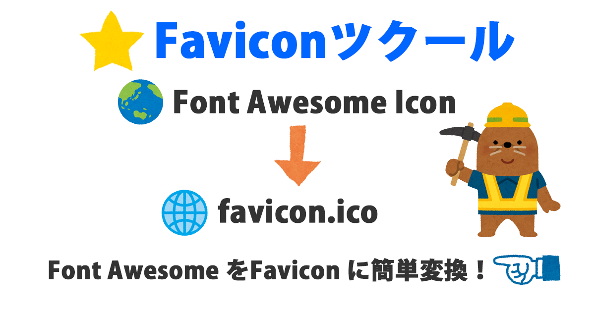
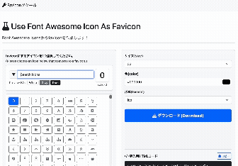

# 🚧 Faviconツクール

<!-- 技術バッジ -->

)

Font Awesome Iconsをfavicon（ファビコン）に簡単に変換できるツールです。
UIを **Bootstrap 5** にアップデートしました。スマートフォンにも対応しています。

---

## 📸 デモ (Demo)

実際の動作は以下のURLから確認できます：
👉 [https://tsukuba42195.sakura.ne.jp/fontawesome_to_favicon/](https://tsukuba42195.sakura.ne.jp/fontawesome_to_favicon/)

---

## 🚀 使い方 (Usage)

1. このリポジトリをクローンまたはダウンロードします。
2. すべてのファイルを、PHPが動作するWebサーバーにアップロードします。
3. ブラウザから該当のディレクトリにアクセスすれば、すぐにファビコンの生成を開始できます。

---

## 🛠️ クレジット・外部ライブラリ (Credits & External Libraries)

本プロジェクトでは、以下の外部ライブラリ・ttfファイルを使用しています：
* [Bootstrap 5](https://getbootstrap.com/)
* [Font Awesome 6.7.2](https://github.com/FortAwesome/Font-Awesome/tree/fa-release-6.7.2/webfonts)

これらの作品は、その後に変更が加えられている場合であっても、オリジナルのライセンスが適用されます。

---

## 📄 ライセンス (License)

Copyright 2021-2026 Akira Mukai.  
Licensed under the [MIT License](LICENSE).

---

## 👨‍💻 開発者（Developer）

**向井 聡 (Akira Mukai)**

Blog
https://s0323861.github.io/

GitHub
https://github.com/s0323861

---

## ❤️ サポート（Support）

If this project helped you, consider supporting its development.

☕ Buy me a coffee:
https://ko-fi.com/akiramukai

