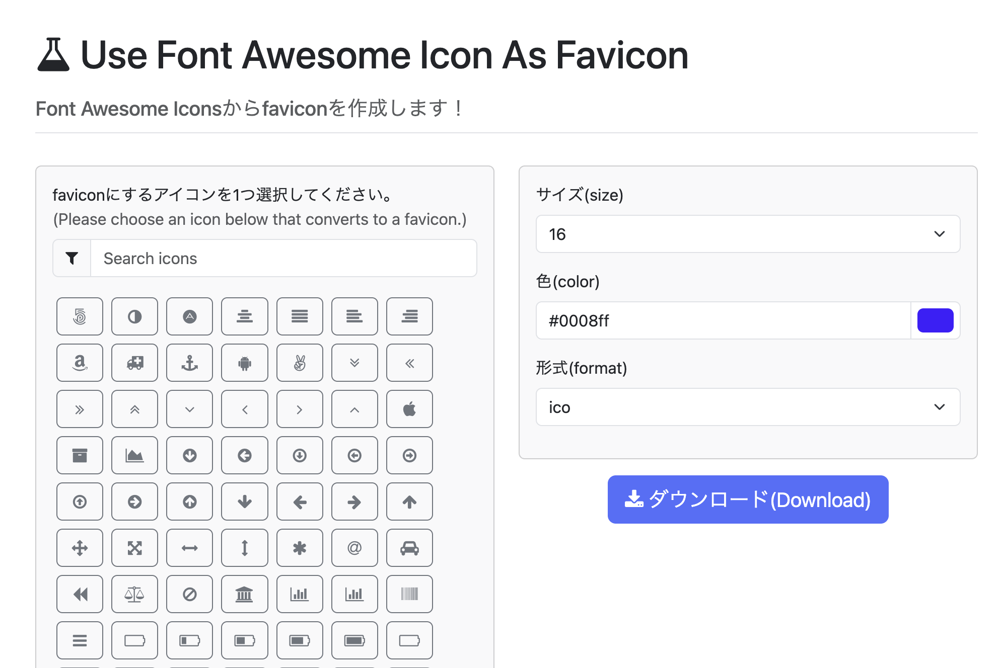

# fontawesomeicons_to_favicon

A simple PHP application to convert Font Awesome Icons to favicons. 
This project has been updated to use **Bootstrap 5** for a more modern and responsive interface.

## Demo

You can try out the live application here:
👉 [https://tsukuba42195.sakura.ne.jp/fontawesome_to_favicon/](https://tsukuba42195.sakura.ne.jp/fontawesome_to_favicon/)

---

## Usage

1. Clone or download this repository.
2. Upload all files to your PHP-enabled web server.
3. Access the directory via your browser to start generating favicons.

---

## Credits & Externally Licensed Works

This project makes use of certain externally licensed works, including:
* PHP Font Awesome to PNG
* PHP ICO
* [Bootstrap 5](https://getbootstrap.com/)
* jQuery
* Bootstrap Colorpicker

Any such works retain their original license, even if they have been subsequently modified.

---

## License

Copyright 2021-2026 Akira Mukai.  
Licensed under the [MIT License](LICENSE).
